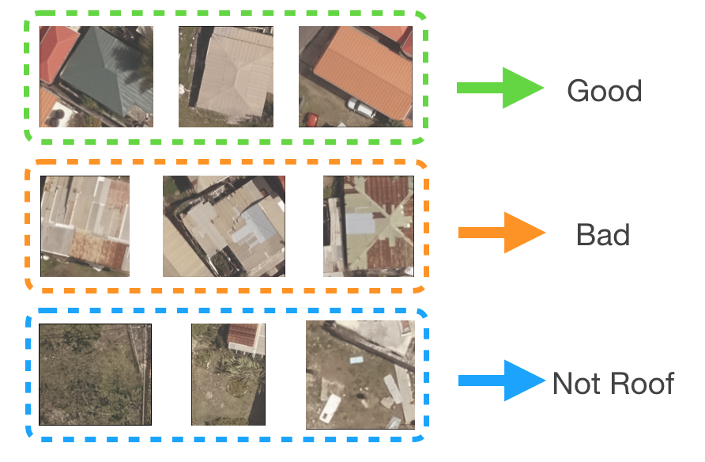

**Problem Statement**
---

Our project goal was to use drone RGB data and GIS data from the Caribbean Handbook on Risk Information Management (CHARIM) to train a convolutional neural network (CNN) to identify buildings that may need repairs to prepare for future hurricanes on the island of St. Lucia. This model was trained on imagery from the town of Dennery, but the provided code can be applied to drone imagery collected from any location on the island. The model output is linked to the building ID number included in the CHARIM GIS data and can be used as part of a tool which allows the user to click on a building and see all relevant information. Due to the nature of this data, we are not able to provide the drone image on Github. Links to the developed notebooks are provided below:

*   [01 - Image Cropping Workflow](https://github.com/bcwalraven/st_lucia_roof_imagery/blob/master/01_image_cropping_workflow.ipynb)
*   [02 - Categorical Data CNN](https://github.com/bcwalraven/st_lucia_roof_imagery/blob/master/notebooks/02_process_code.ipynb)
*   [03 - Binary Data CNN](https://github.com/bcwalraven/st_lucia_roof_imagery/blob/master/03_binary_CNN.ipynb)
*   [04 - Production Code (notebook)](https://github.com/bcwalraven/st_lucia_roof_imagery/blob/master/04_process_code.ipynb)
*   [05 - Production Code (python script)](https://github.com/bcwalraven/st_lucia_roof_imagery/blob/master/05_process_code.py)
*   [06 - Presentation Slides](https://github.com/bcwalraven/st_lucia_roof_imagery/blob/master/06_Presentation_Code.pdf)

This project was developed by:

*   [Brandon Walraven](https://www.linkedin.com/in/brandonwalraven/) 
*   [Sarah Scolnik](https://www.linkedin.com/in/sarah-scolnik/)
*   [Kyle Sokolis](https://www.linkedin.com/in/kyle-e-sokolis/)
*   John Milne

This project was part of a partnership between [New Light Technologies](https://newlighttechnologies.com/) and General Assembly, in which New Light Technologies provided real-world data and problems for students to tackle in the field of disaster response and management.

**Executive Summary**
---

Drone image data was collected showing rooftops in the small island town of Dennery on the island of St. Lucia to help the island prepare for future hurricanes. Given that there are approximately 80,000 buildings on the island of St. Lucia, developing a model that can quickly screen for damaged roofs would be useful for anyone assessing how to prepare the island for hurricane season. We created a set of individual roof images from the provided drone data by layering a shapefile with coordinates for all St. Lucia buildings from the Caribbean Handbook on Risk Information Management (CHARIM) database. Individual roof images were cropped using the bounding box for each building. We then trained a CNN to correctly classify images as either non-roof, good-quality roof, or poor-quality roof. Our initial model correctly identified 38% of the non-roof images and 73% of the poor roof images in the dataset, with a total accuracy for all three categories of 72% from a 56% baseline. This is a strong proof of concept for the model's viability if it could be trained on a larger set of images. The files provided in this repo include a production code file (both notebook and .py formats) that will take any drone image from St. Lucia, create individual images for each roof, classify them with the trained CNN model, and return a filtered version of the CHARIM buildings information with only the buildings the CNN identified as poor-quality. 

**Required Python Libraries**
---

**Data Manipulation:**
*   Numpy
*   Pandas

**Geospacial Manipulation:**
* rasterio
* geopandas
* pysal
* shaply
* projpy
* fiona

**Modeling:**
* keras
* sklearn

**Data Visulation:**
* MatPlotLib

**Provided Code**
---

Four different files are included in this repo:

Image Cropping Workflow:

This code explores the drone data provided by New Light Technologies and includes several visualizations to help demonstrate our method for isolating individual roof images.

Categorical CNN:

This code shows how the categorical CNN for non-roof, good-roof, and poor-roof classification was built and trained. The final model is saved for later use.

Binary CNN:

This code shows how a binary CNN for classification of only good-roofs and poor-roofs. All non-roof images were excluded from the training data. It shows the potential for improved performance if an effective method for separating non-rof images is implemented before the roof classification. 

Production Code:

This code was designed to be a functional script that streamlines the image cropping workflow and generalizes it any building on St. Lucia. Drone image data from anywhere on the island can be taken as an input file and it will create folder of individual roof images in the directory the file is run. It then classifies these images with the most recent model trained in the Categorical CNN code, and outputs a CSV in the same format as the CHARIM database that lists all the buildings identified as having poor roof quality. This code has been provided in both jupyter notebook and .py formats. 

The diagram below illustrates how the Categorical CNN and Process Code work together.

**Challenges**
---

**Reconciling Coordinate Systems**

In order to correctly overlay the drone image data and the CHARIM building shapefiles, both datasets need to be in the same coordinate reference system (CRS) and in the same units. An initial stumbling block in this project was while both files were proved in the same CRS ([EPSG:32620](https://epsg.io/32620)) but had different units. This was not immediately obvious as inspecting both files confirmed they were indeed in the same CRS. Given the different units we could not properly overlay the two files. By plotting out the drone data with rasterio python library we could observe that the coordinates were actually the meters East and North of the [UTM 20](http://www.spatialreference.org/ref/epsg/wgs-84-utm-zone-20n/) bounding box, not in latitude and longitude as assumed. With some research we located the PyProj library, which allowed us to transform the CHARIM shapefile to (X, Y) coordinates from latitude and longitude. 

**Unlabeled Data**

We sorted the initial training set of roof images ourselves using our own judgement as to which roofs appeared to need repair. More accurate results may be possible if the images are classified by a subject matter expert. Classifying a sufficiently large set of roof images for training a high-performing model would take more work, however once the model is trained, it will save the work of manually classifying all additional images.

**Dealing With Small Data Sets**

To compensate for the low number of images available to us, we used the Keras ImageDataGenerator class to augment our images by applying random transformations so that the model never sees the exact same image twice during training. See the graphic below. 

 

>>>>>  gd2md-html alert: inline image link here (to images/Problem-Statement-copy3.png). Store image on your image server and adjust path/filename if necessary.  (<a href="#">Back to top</a>)(<a href="#gdcalert5">Next alert</a>) >>>>> 

**Results and Analysis**
---

When evaluating the model we want to ensure that both non-roof images and poor roofs are being correctly identified. To evaluate this, the two most important metrics to focus on are non-roof recall and poor-quality roof recall. They describe the percent of each category that the model correctly identified. Respectively, our model scored 38% on non-roof recall and 73% of poor-roof recall. Neither of these values is likely high enough to merit practical use of this model, however, given the small number training images, we feel this is a viable proof of concept. In addition to more data, a two model system could be built so that non-roof images are filtered out separaetly, allowing both models to specialize. In this case the roof quality classification would be done with a binary classification, which we also demonstrate in this repo. A normalized confusion matrix of our current results is included below:

**Future Improvements**
---

**Automating the image cropping workflow**

Machine learning could also be applied to the problem of cropping individual roof images from the large drone image. A new model could be trained to identify individual buildings in the drone image. This would be especially useful for areas that do not have accurate building shape data available.

**More sorted images**

A larger training data set will help avoid overfitting the model to the data, creating a better model.

**More image preprocessing**

Additional image processing could be applied to the roof images to help the model recognize important features. Morphological operations such as erosion and dilation are used on images to: 

*   Remove noise
*   Isolate individual elements and join disparate elements in an image
*   Find intensity of bumps or holes in an image

**View output in ArcGIS or another tool**

The output includes the building ID number (from the GIS data) for all of the roofs classified as poor-quality. Therefore the classification and the individual roof image could be linked to the building shapefile using the building ID number. If desired, the code could be changed to output the good-quality roof and no-roof classes in addition to the poor-quality roofs. Then all of the data could be displayed in ArcGIS so that a user could click on a building and see the roof classification, the image of the roof, and any building data available from the shapefile. This functionality could also be programmed in some other platform using the same data.
